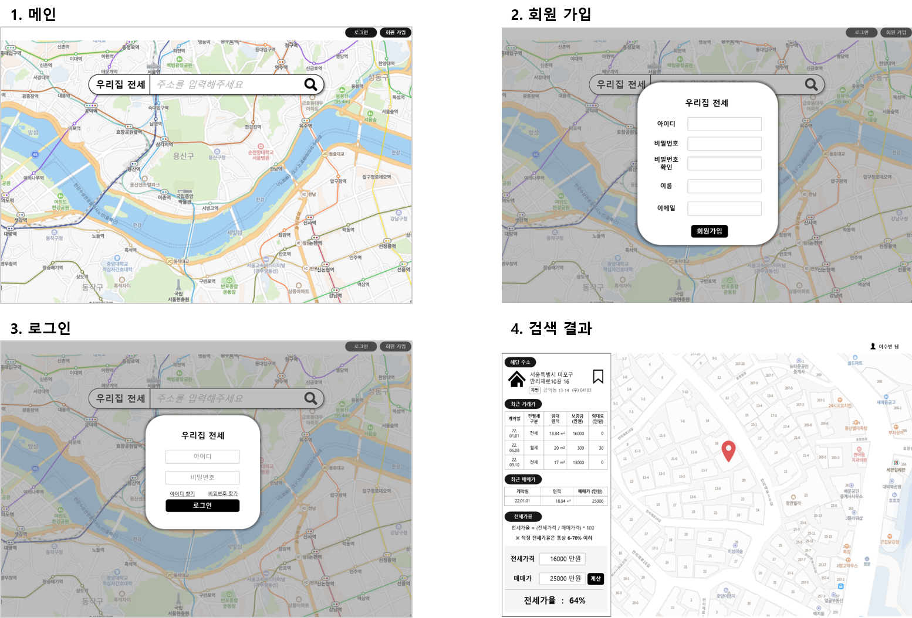
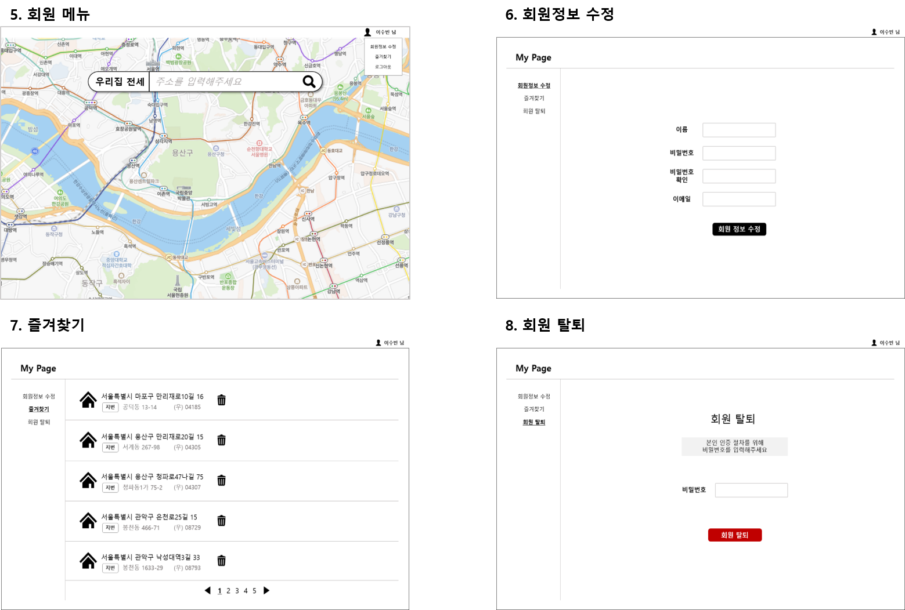

# 우리집 전세 (전월세 가격 비교 시스템 & 깡통전세 판별)
## 프로젝트 개요
- 최근 문제가 되고있는 깡통 전세에 대비할 수 있도록 서울시에서 제공하는 전월세 신고자료를 제공하고,  
  주변 집들의 전월세 시세와 비교하여 전세 사기에 대비할 수 있도록 하자는 취지
## 주요 기능
- 회원
  - 회원 가입
  - 로그인
  - 집 주소 즐겨찾기
- 검색
  - 집 주소 검색
  - 해당 주소의 최근 전월세 가격 조회 
- 공공 데이터 API 연계
  - 서울시 부동산 전월세가 정보 (http://data.seoul.go.kr/dataList/OA-21276/S/1/datasetView.do)
  - 서울시 부동산 실거래가 정보 (http://data.seoul.go.kr/dataList/OA-21275/S/1/datasetView.do)
  - 주소 정보 검색 API (https://business.juso.go.kr/addrlink/main.do?cPath=99MM)
- 기타
  - 전세가율 계산
- 검토중
  - 주변 집들의 전월세 가격 조회
## 화면 설계

## 사용 기술
- Java
- Spring Boot
- JPA
- MySQL
- Spring Data JPA
- Lombok

